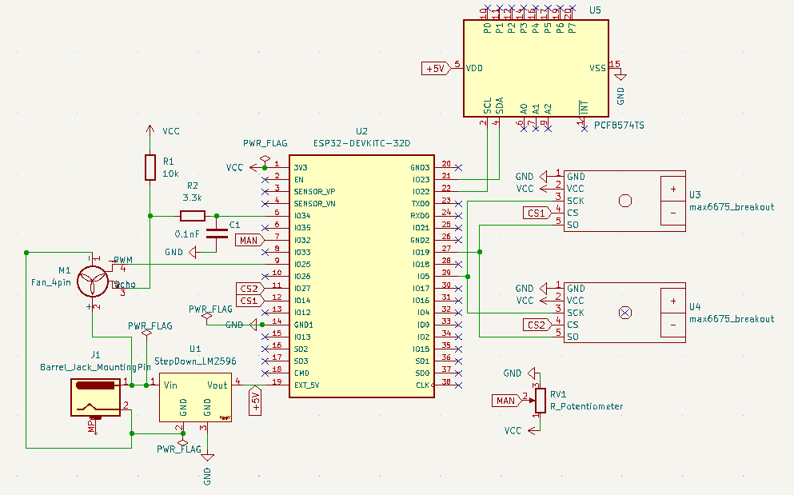

# Smoken!
A temperature controlled fan for charcoal smoker using ESP32.
 
## Background
After taking a welding course, I decided to build a smoker. Shortly after, I realized I must have a solution to keep the temperature steady for many hours. Searching around the internet I found only terribly expensive products (like the [FIREBOARD](https://www.fireboard.com/shop/fireboard-2-drive/?fba_ref=14)). That motivated me to try my first IOT project!

I took this opportunity to gain some skills in the electrical engineering domain.
I used an ESP32 for the MCU (started from [ESP32 starter kit](https://www.ebay.com/itm/303652581313)), built a working prototype using a breadboard and then went on to design a PCB for it (using [KiCad](https://www.kicad.org/)).

I will try to highlight the main lessons learned throughout this process.

## How It Works
- An ESP32 is connected to a thermocouple (with max6675 amplifier) to measure the smoker's current temprature. Another thermocouple is connected just to monitor the meat's temprature.
- The ESP32 is also connected to a 4-pin fan and controls it through a PWM channel with A PID algorithm.
- An external power of 12V/5A is used for both the fan and the ESP32 (through a step-down regulator).
- An 1602 LCD screen is used for simple information.
- A web server is used to monitor the current status, and configure things like the wifi credentials and some paramteres.
- A potentiometer is also available to have manual control over the fan.

### Circuit Schema

### Inventory List

|name|price|quantity|
|----|----|---|
|Esp 32|4|1
|12v power supply|3.7|1
|12v/3A blower fan 4pin|15.4|1
|12v to 5v step down|4|4
|LCD 1602|2.4|1
|max6675|7.3|2
|thermocouple|5.3|2
|small bread board|4.3|3
|4p connector|2.6|10
|wire 4p|5|5m
|3.3k resistor|1.5|300
|wires|3|120

### Afterthoughts
- I could have used a much weaker fan
- Replace the 1602 LCD with 12864 OLED

### Gotchas
- Fan's tacho required RC filter to get the correct reading
- Pin 4 as ADC with wifi.h [bug](https://github.com/espressif/arduino-esp32/issues/102)

## Code
- Use Platform IO as it is way more convenient than the Arduino IDE
- Web server using ESPAsyncWebServer
- Web-based config using AsyncWebConfig
- Use the SPIFFS to save data like a webpage, config file, and data history
- Use git from the beginning

### Gotchas
- [PWM's max freq/precision](src/fan.cpp#L18)

### Some Refs
- basic ESP32 examples:
  - https://lastminuteengineers.com/handling-esp32-gpio-interrupts-tutorial/

- connect max6675:
  - https://github.com/adafruit/MAX6675-library/blob/master/examples/serialthermocouple/serialthermocouple.ino
  - http://www.esp32learning.com/code/esp32-and-max6675-example.php

- connect multiple max6675:
  - https://arduino.stackexchange.com/questions/37193/multiple-3-wire-spi-sensor-interfacing-with-arduino
  - https://forum.arduino.cc/t/problem-with-multiple-max6675-thermocouple/573336/7

- Circuit example:
  - https://github.com/KlausMu/esp32-fan-controller

- PID:
  - https://playground.arduino.cc/Code/PIDLibrary/

- Another ref project:
  - https://github.com/chris948/esp_grillcon/blob/master/esp_grillcon.ino

- Fan specs:
  - https://www.mouser.co.il/datasheet/2/632/BFB1012EH-C18J-1602075.pdf

## PCB

- Used KiCAD
- YouTube tutorial:
  - https://www.youtube.com/watch?v=vaCVh2SAZY4
- Nice getting started tutorial:
  - https://medium.com/invent-io/getting-started-with-embedded-systems-3-schematic-pcb-design-manufacturing-5566b2cf6963
- To search and download additional CAD modules:
  - https://www.snapeda.com/home/
  - https://grabcad.com/library
- Ordered PCB from:
  - https://jlcpcb.com/
